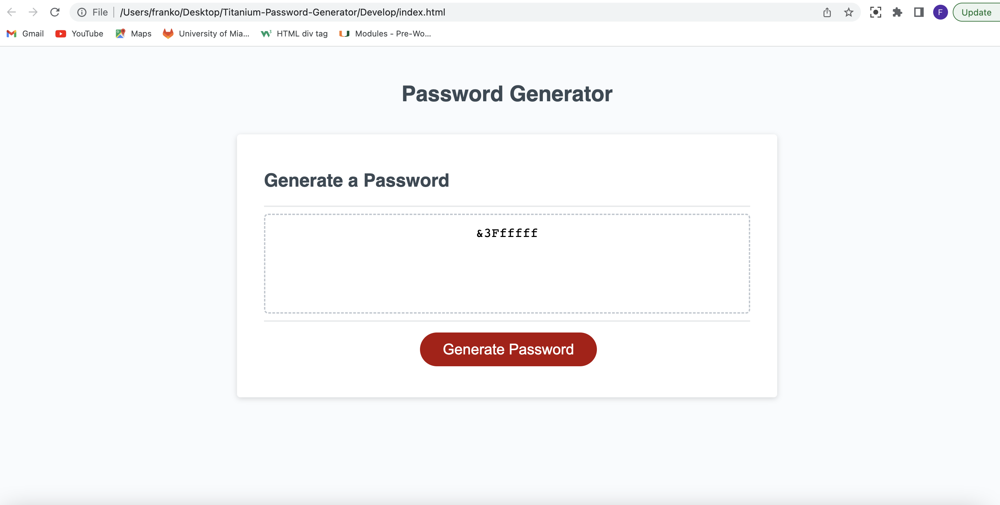

# Titanium-Password-Generator
Special generator for a password including characters for an employee with sensitive data.

Making an App to run on a browser for an employee that has sensitive , top secret, data that cannot be shared.The employer or user has to create a secure, long, hard-to-guess password to make it hard for an attacker or hacker to access the sensitive data and to increase the security posture of the company.

The index.html is the content of the password generator, the script.js provides the functioanlity of the password generator according to the user selections and the style.css provides the cosmetics and layout of the password generator. All 3 files are under the common folder called /Develop, and Develop folder is under my repo called Titanium-Password-Generator. Starter code was provided by professor and the repo has a flat structure.

URL: https://franko88bit.github.io/Titanium-Password-Generator/

Screenshot of Titanium Password Generator:
